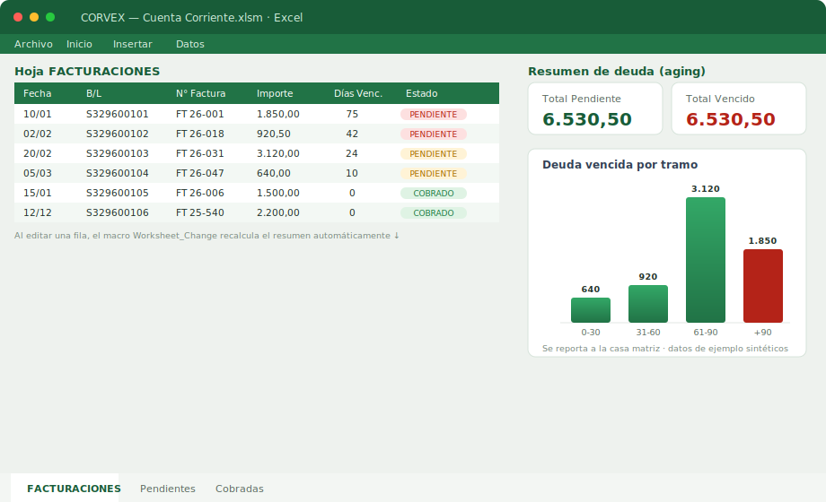
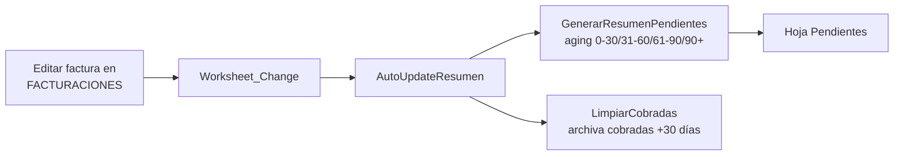

# 🚗 Cuenta Corriente por Marca de Autos — Excel/VBA

> Planilla con macros que lleva la **cuenta corriente de cada marca automotriz**: registra
> las facturas de flete emitidas a la terminal, calcula el **vencimiento (aging) de la deuda**
> y mantiene un resumen siempre actualizado para reportar el saldo de cada marca a las
> oficinas centrales de la línea (Nápoles).

> ℹ️ Versión **anonimizada para portafolio**: se publica únicamente el **código VBA** y un
> **ejemplo sintético**. Los libros `.xlsm` con facturas reales de clientes/marcas **no** se
> incluyen. El código no contiene datos ni credenciales.

---

## El problema

Cada marca automotriz (CORVEX, PEGASO, BIONDA, RIGEL, MISTRAL, AVALON, HELIOS, GRIFON, QUASAR, EVORA, …)
acumula decenas de facturas de flete por mes. Saber **cuánto debe cada marca y desde hace
cuántos días** —para reclamar el cobro y reportar el saldo a la casa matriz— se hacía
revisando planillas a mano. Esta herramienta lo automatiza dentro de Excel: el operador solo
carga/edita las facturas y el resumen de deuda vencida se recalcula **solo**.

## Cómo funciona

- Hoja **`FACTURACIONES`**: una fila por factura (B/L, N° factura, importe, días vencidos,
  estado `PENDIENTE`/`COBRADO`, fecha de cobro).
- Un macro **event-driven** (`Worksheet_Change`) detecta cambios en las columnas relevantes y
  dispara la actualización **sin botones**.
- Genera/actualiza la hoja **`Pendientes`** con el total adeudado y el **aging por tramos**:
  `0-30`, `31-60`, `61-90` y `+90 días` vencidos.
- Archiva automáticamente (`LimpiarCobradas`) las facturas ya cobradas con más de 30 días.

## Módulos VBA

| Archivo | Rol |
|---|---|
| [`vba/ThisWorkbook.cls`](vba/ThisWorkbook.cls) | Disparador a nivel libro (`Workbook_SheetChange`) |
| [`vba/Hoja_FACTURACIONES.cls`](vba/Hoja_FACTURACIONES.cls) | Lógica de la hoja: detección de cambios de estado y de días vencidos |
| [`vba/modResumen.bas`](vba/modResumen.bas) | Cálculo del resumen, buckets de aging y limpieza de cobradas |

## Cómo usarlo

1. Crear un libro `.xlsm` con una hoja `FACTURACIONES` (ver columnas en
   [`samples/FACTURACIONES_ejemplo.csv`](samples/FACTURACIONES_ejemplo.csv)).
2. En el editor de VBA (Alt+F11), importar los tres archivos de `vba/`.
3. Al cargar/editar facturas, el resumen de `Pendientes` se actualiza automáticamente.

En producción se usa **un libro por marca** (con variantes *Locales* y *Nápoles* según el
origen de la factura), todos compartiendo este mismo motor de macros.

## Stack

Excel · VBA (macros event-driven) · `VBScript.RegExp` para detección de moneda.

## ♻️ ¿A quién le sirve / cómo reutilizarlo?

Útil si querés un **control de cuenta corriente con aging automático en Excel** (sin botones, por eventos).
Para adaptarlo: importá los 3 módulos de `vba/` a un libro con una hoja `FACTURACIONES` (ver `samples/`) y
ajustá las constantes de columnas/umbrales en `modResumen.bas`. Sirve para **cualquier cartera de deudores**,
no solo marcas de autos.
